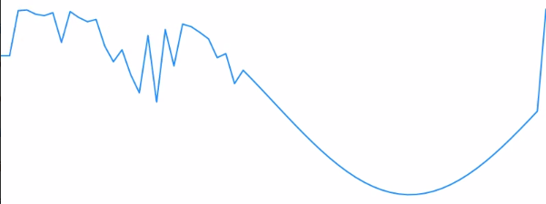

Sorting Sines

Sine being sorted by heapsort

requires moviepy <= 1.0.3

Inspired by the [classic sorting sounds](https://www.youtube.com/watch?v=kPRA0W1kECg) this project sorts sine waves with different sorting algorithms. The sound is derived by playing back the array as a wavetable. The state of the array corresponds to a timbre, the differing sorting algorithms correspond to different timbre changes. An mp4 and a soundfile is created (see examples in outputs).

usage: python3 main.py \[arguments\]

--sort \[select one of the implemented algorithms, default: bubblesort\] (bubblesort, selectionsort, heapsort, insertions sort, quicksort)

for quicksort, a pivot has to be chosen (pivot_first, pivot_last, pivot_middle, pivot_random)

--freq \[select an int as frequency of the sound generated in hz, default 220hz\] 

--speed \[select an int as number of sorting steps per minute, default 50\]  

--hold \[select a float as time in seconds, the sound is not morphed at the end and the beginning, default 1.0\] 

--save_audio \[select true/false for storing a separate .wav file, default true\] 

--frames \[select number of frames per second for the video, default 12\] 
 
 
 
 
 
**to do next** 

implement mergesort, counting sort, radix sort (not in place)

remove click at the end of bubblesort video 

remove clicks and other problems with quicksort

add start with a shuffled sine 

real time wavetable morphing 

create an oscillator based on this 
